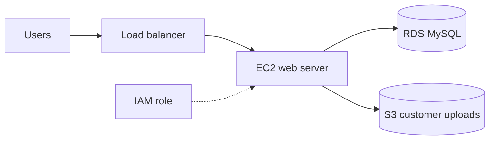

# ☁️ Cloud Security: Before vs After


The same AWS web app stack written twice in **Terraform**: once the way real breaches start,
and once hardened. An automated **Checkov** scan in **GitHub Actions** proves the difference on every push.

```
STACK          PASSED   FAILED  SKIPPED
insecure/          19       41        0     ❌ 41 security issues
secure/            91        0        5     ✅ all fixed
```

> ⚠️ `insecure/` is **deliberately vulnerable** and exists only to be scanned.
> It has a built-in safety lock: `terraform plan` and `terraform apply` always fail on it.

## The stack

A typical small web application on AWS:



## What was wrong and how it was fixed

| # | ❌ Insecure | Why it's dangerous | ✅ Secure fix | Checkov IDs |
|---|---|---|---|---|
| 1 | S3 bucket public, with a policy allowing `Principal: *` | Anyone can list and download all customer files, the cause of countless real data leaks | All 4 public access blocks on, HTTPS-only bucket policy | CKV_AWS_53–56, CKV2_AWS_6 |
| 2 | No S3 versioning | Deleted or ransomware-encrypted files are gone forever | Versioning + lifecycle rules | CKV_AWS_21, CKV2_AWS_61 |
| 3 | No customer-managed encryption | No control over who can decrypt the data | SSE-KMS with a rotating customer-managed key | CKV_AWS_145 |
| 4 | No S3 access logging | Impossible to investigate who accessed what | Access logs sent to a separate log bucket | CKV_AWS_18 |
| 5 | SSH (22) and RDP (3389) open to `0.0.0.0/0` | Bots start brute-forcing within minutes | No admin ports at all. Access goes through **SSM Session Manager** | CKV_AWS_24, CKV_AWS_25 |
| 6 | All outbound traffic allowed | Makes data exfiltration and malware callbacks easy | Only HTTPS out, and MySQL only inside the VPC | CKV_AWS_382 |
| 7 | IAM policy `Action: "*"`, `Resource: "*"` | A hacked web server means a hacked AWS account | **Least privilege**: only its own bucket and key | CKV_AWS_62, 63, 286–290, 355, CKV2_AWS_40 |
| 8 | EC2 has a public IP | Server is directly exposed to the internet | Private subnet behind the load balancer | CKV_AWS_88 |
| 9 | IMDSv1 enabled | SSRF can steal instance credentials ([Capital One 2019](https://krebsonsecurity.com/2019/08/what-we-can-learn-from-the-capital-one-hack/)) | IMDSv2 required, hop limit 1 | CKV_AWS_79 |
| 10 | Unencrypted EBS disk | Snapshots and disks can be read if leaked | Encrypted with KMS | CKV_AWS_8 |
| 11 | Passwords and API keys hardcoded in code | Secrets stay in Git history forever | AWS-managed password in **Secrets Manager** | CKV_SECRET_6 |
| 12 | RDS publicly accessible | Database reachable from the internet | Private only, reachable from the web SG only | CKV_AWS_17 |
| 13 | RDS unencrypted | Data at rest can be exposed | Encrypted with KMS | CKV_AWS_16 |
| 14 | No backups, no deletion protection, single AZ | One mistake or outage loses everything | 7-day backups, deletion protection, Multi-AZ | CKV_AWS_133, 293, 157 |
| 15 | No database logs or monitoring | Attacks go unnoticed | Audit logs to CloudWatch, enhanced monitoring, IAM auth | CKV_AWS_129, 118, 161 |

## Accepted risks (skipped checks)

Real security work is not about reaching zero warnings at any cost. It is about making **conscious,
documented decisions**. Five checks are skipped in `secure/`, each with a written reason next to it:

| Check | Reason |
|---|---|
| CKV_AWS_144 (×2) cross-region replication | Disaster-recovery choice with extra cost, out of scope for this demo |
| CKV2_AWS_62 (×2) S3 event notifications | No downstream system needs them |
| CKV_AWS_18 on the log bucket | It *is* the log bucket; logging it into itself would loop |

## How the CI pipeline works

Every push runs [`.github/workflows/security-scan.yml`](.github/workflows/security-scan.yml):

1. **Terraform format & validate**: both stacks must be well-formed.
2. **Checkov scan** via [`scripts/scan.sh`](scripts/scan.sh). The build fails if:
   - `secure/` has **any** failed check (a regression was introduced), or
   - `insecure/` has **zero** failed checks (the scanner stopped catching the planted issues).

The results table is posted to the Actions **job summary** page.

## Run it yourself

No AWS account is needed. Nothing is deployed, the code is only scanned.

```bash
git clone https://github.com/t4lh8/cloud-security-before-after.git
cd cloud-security-before-after
pip install checkov

checkov -d insecure        # see every issue in detail
checkov -d secure          # all passing
bash scripts/scan.sh       # side-by-side comparison
```

## Project structure

```
├── insecure/                # ❌ vulnerable stack (scan only, never deploy)
│   ├── main.tf
│   └── variables.tf
├── secure/                  # ✅ hardened stack
│   ├── main.tf
│   └── variables.tf
├── scripts/scan.sh          # before/after comparison + CI gate
└── .github/workflows/
    └── security-scan.yml    # GitHub Actions pipeline
```

## What I learned

- Writing AWS infrastructure as code with **Terraform**
- The most common cloud misconfigurations behind real breaches: public buckets, open ports, over-privileged IAM, IMDSv1 and hardcoded secrets
- **Defense in depth**: network isolation, least privilege, encryption, logging and backups working together
- **Policy-as-code** scanning with Checkov and shifting security left into **CI/CD**
- Documenting **risk acceptance** instead of blindly silencing warnings

## License

[MIT](LICENSE)
